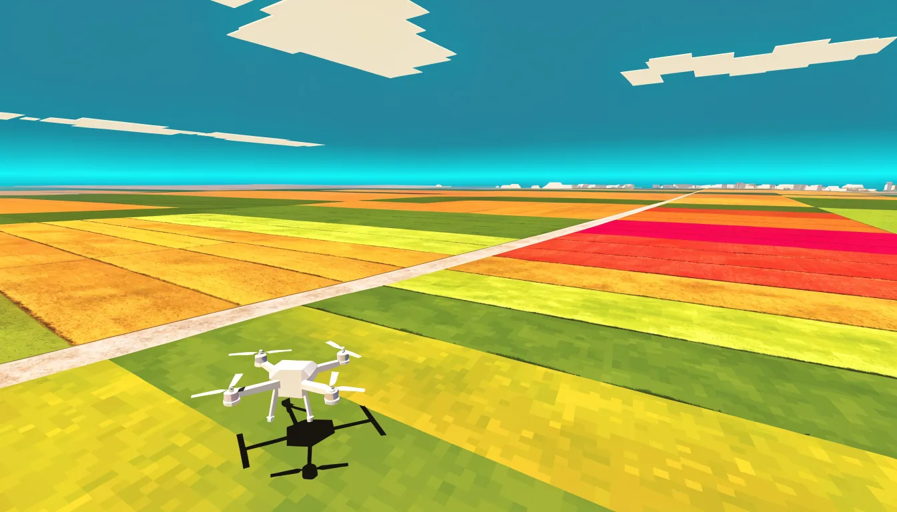

# aurelioochoa.github.io

Personal site for Aurelio Ochoa: software developer, certified agricultural drone pilot,
trained cook. <https://aurelioochoa.github.io>

The site is plain HTML, CSS and ES modules, served by GitHub Pages exactly as it sits in this
repo. Nothing runs at deploy time. Fonts, imagery and every WebGL scene are self-hosted, and
**nothing is fetched from a CDN at render time**, which the `no-network` gate enforces by
walking the page with a request interceptor rather than by grepping for URLs.

There is one build, and its output is committed: `make scenes`. It exists because the ThreeUI
scenes arrive as npm modules and as HTML documents that load Tailwind, GSAP, three.js,
Iconify and Google Fonts from public CDNs. They are vendored into this repo instead, and
edited to carry this site's own content. See `build/scenes.mjs`.

```
index.html            fourteen acts, hard cuts between three worlds
styles/site.css       one stylesheet, tokens documented in DESIGN.md
js/main.js            language switch, act reveals, drone and clouds wiring
js/i18n.js            data-i18n driven translation
js/drone.js           the WebGL sprayer and its depth layering, written against raw WebGL
js/rc.js              the controller in act 10: press, then press and hold
js/audio.js           the sound, synthesised: rotors, spray, controller cues
js/clouds.js          the CSS 3D clouds behind the SKY card, sprite drawn on a canvas
js/scenes.js          mounts the ThreeUI scenes, disposes them offscreen
js/vendor/            committed build output: the scene bundle, three.js and its addons
scenes/               the ThreeUI scenes, vendored and edited  (built)
landing-pages/        the projects shelf, holding the public repositories  (built)
build/                the generators that produce the two directories above
assets/languages/     en, es, de
assets/img/           generated placeholders, each marked with data-replace
assets/art/           authored interface art: the controller line art  (built)
cv/                   the CV builder: data in, three PDFs out
tools/                the acceptance gates
```

## The ThreeUI scenes

The hero's keycap field, the elemental marks, the three cloths, the liquid metal button and
the projects shelf all come from [ThreeUI](https://threeui.com) (MIT). None of them is used
as shipped, and none of its React components is used at all:

- Its **renderer engines** are plain functions, so the keycap field, the condensation, the
  dock's magnify physics and the heading decode are driven directly against this page's own
  DOM. Two of its components, `AnimatedTopDock` and `ArticleHeadings`, render fixed content
  and take no children, so used whole they would have replaced this site's navigation and its
  copy with their own.
- Its **scenes are whole HTML documents**. Those are read out of the package by
  `build/scenes.mjs`, stripped of their remote dependencies, and edited: the elements scene
  rendered the OpenAI, Anthropic and Claude logos and now burns, freezes and electrifies this
  site's own words; the cloth was a Kyoto textile studio's landing page and is now a banner
  with Aurelio's name woven into it; the shelf held seven AI tools and now holds his ten
  public repositories.

Every edit asserts on the upstream text it expects, so a package bump that moves the ground
fails the build instead of quietly shipping someone else's logo.

`DESIGN.md` is the design language: colour, type, shape, motion, and the bans. Read it before
changing anything visual.

## The imagery is placeholder

Every file in `assets/img/` is a generated stand-in for a real photo. Each slot in the markup
carries a `data-replace` attribute naming what belongs there, so a real photograph can be
dropped in without touching the layout:

```html

```

`assets/art/` is a different directory on purpose. It is authored interface art, not a stand
in for a photograph, so nothing in it carries a `data-replace` slot and `gate-tells` does not
ask it to. It holds one file today, the radio controller in the handover act, produced once
from a source SVG that lives outside this repo:

```bash
python3 build/controller.py ~/Downloads/control.svg   # 906KB of SVG in, 95KB of WebP out
```

## The flying is keyboard only

The drone's canvas is fixed, full-viewport and above every act, so it is `pointer-events:
none` permanently. It cannot be otherwise: the moment that canvas takes a pointer event it is
a sheet of glass over the CV link, the language toggle, the email CTA and the shelf. Dragging
the aircraft was worth less than the rest of the site, so W A S D and the arrow keys fly it
and nothing is bound to the canvas at all. `gate-drone` asserts both halves of that.

The handover is the controller instead, and it powers on the way the real one does: press the
power button once, then press and hold it for two seconds. The aircraft answers with its own
power-on, which is DJI's real status-light sequence: self test, warm up, link. The keys are
live from the tick the hold finishes; the sequence is lights and copy only.

Spraying is the dial on the controller's right shoulder, where it is on an RC Plus, or `F`
from anywhere on the page. Not the space bar: the arrows already went to flying, and the
space bar is how a keyboard-only visitor scrolls.

Flying up and down also moves the page, which is the rest of that same debt: arming the drone
spends W, S and the arrows on the aircraft, so the aircraft is what gives keyboard scrolling
back. There is a dead band through the middle of the frame where flying is only flying, and
past it the page eases into a scroll that gets faster the further out the aircraft is. It
only runs while a key is held, so an aircraft parked near an edge sits still.

## It passes over some things and behind others, and through the copy

The canvas is a single layer above every act, and it stays one. Depth against the page is
bought in the depth buffer: each frame the drone projects the viewport rects of the elements
marked `data-drone="behind"` into its own scene as quads that write depth and no colour, so
it is clipped exactly where it is behind one. The chrome, the three plates and the shelf opt
in that way; every ground does not, because the aircraft has to stay visible the whole way
down for the handover's line about it to be true. Only opaque rectangles may opt in, since a
depth quad covers the whole rect whether or not the element paints it.

Copy opts in differently. An element marked `data-drone="cross"` gets a quad on the plane
the aircraft's depth drift passes through, so it is sometimes in front of that copy and
sometimes behind it, and the quad carries a **coverage mask rasterised off the element's own
text**: a fragment the letterforms do not cover is thrown away before it writes depth. So it
is cut out on the glyphs and nowhere else, and it flies through a headline rather than
disappearing into the rectangle that contains one.

The mask is drawn word by word off `Range` rects, which is the only way it lands on the
glyphs at any viewport and in all three languages: the browser has already decided where
every word sits, and re-implementing line breaking to guess at it would be a second opinion
that is wrong at exactly the moment it matters. It is baked in element-local coordinates, so
scrolling never invalidates one; a resize and a mutation do, and the article headings decode
out of scrambled letters on entry, which is a mutation.

## Working on it

```bash
make            # what you can run
make serve      # http://localhost:8000
make check      # every gate, site and CV. add -j4 and it takes 12s instead of 27s
```

The gates, each runnable on its own as `make gate-<name>`:

| Gate | What it holds |
|---|---|
| `old-site-gone` | no residue from the previous design |
| `links-resolve` | every referenced asset exists |
| `i18n-complete` | all three languages complete, and actually translated |
| `e2e` | the language switcher: detection, toggle, persistence, CV link |
| `tells` | no em-dash, no scroll cue, no act counters, eyebrow budget |
| `drone` | WebGL renders, the copy occludes it glyph by glyph, the controller's press-and-hold arms it, clicks still reach the page, degrades without WebGL or with reduced motion |
| `shoot` | scroll walk at desktop and phone, writes `lab/site/` |
| `reveal` | entrances complete on their own, nothing forced |
| `no-network` | every act walked, no request leaves localhost |

The browser gates borrow the Puppeteer already installed under `cv/`; `make install` puts it
there if it is missing. `make install-site` installs what `make scenes` needs.

## The CV

`cv/` renders three language variants of one résumé to PDF.

```bash
make cv         # rebuilds assets/pdf/*.pdf, but only if the sources changed
make check-cv   # the renderer tests plus four gates, including one page per PDF
make shots-cv   # renders each language to cv/lab/ to look at
```

Edit `cv/data/{en,es,de}.json` and rebuild. The renderer throws on a missing key, so a data
file that drifts from the template fails the build instead of printing a blank.

## Credits

jazzskull by [Cathy Jarboe](https://www.cathyjarboe.com/), who animated it in 1999. The
badge in the closing act links to [the video that traced it back to
her](https://www.youtube.com/watch?v=ZYcHOEjGzPA): the GIF spent twenty-four years going
around the internet with nobody's name on it, and by the time it was sourced in 2023 she
had died. Her family found out from that video that it had won an award.
